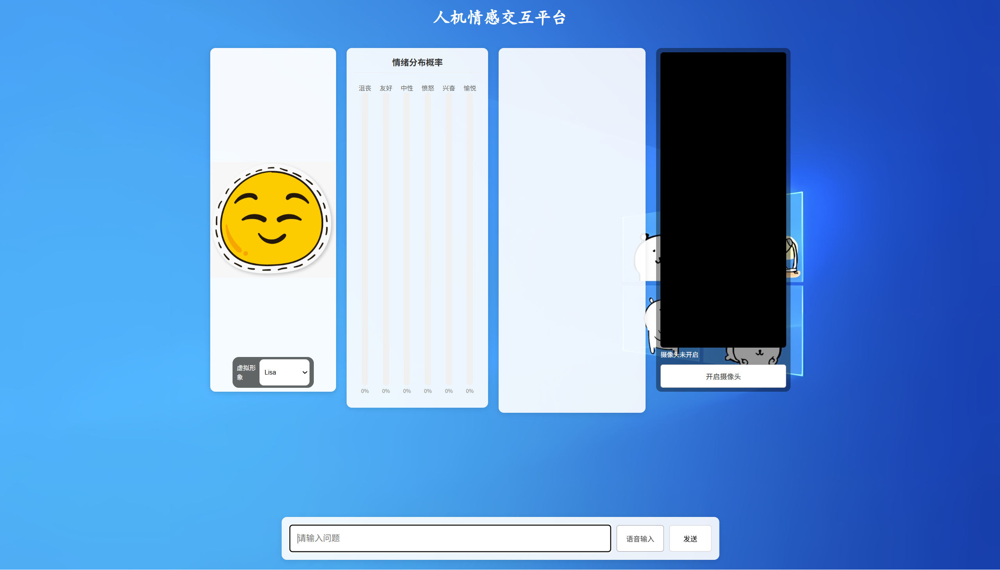

# 人机情感交互系统


## 📝 项目简介
本项目是一个基于 Python FastAPI 和 LangChain 开发的**情感化数字人对话原型系统**。用于情感识别以及基于情绪的交互体验。

系统通过分析用户输入的情绪，动态切换数字人的表情图片，并结合本地知识库提供定制化的回答。

---

## 🛠️ 核心功能

- � **情感驱动交互**
  - **情绪识别**：基于大语言模型自动分析用户输入的情绪概率（支持沮丧、友好、愤怒、兴奋、愉悦等）。
  - **表情切换**：根据识别到的情绪，自动更新前端数字人的表情图片。
  - **情绪柱状图**：实时可视化显示当前对话的情绪分布。

- �️ **语音与文本交互**
  - **语音输入**：利用浏览器原生 Web Speech API 实现语音转文字。
  - **摄像头模式**：支持开启摄像头进行沉浸式语音对话。

---

## 🏗️ 技术实现

- **后端框架**：FastAPI
- **大模型框架**：LangChain
- **向量数据库**：ChromaDB
- **嵌入模型**：HuggingFace m3e-base (本地运行)
- **对话模型**：通义千问 Qwen (或其它兼容 OpenAI 接口的模型)
- **前端技术**：原生 HTML/JS/CSS, WebRTC (用于摄像头调用)

---

## 🔧 安装使用

### 环境要求
- Python 3.10+
- Docker（用于运行 Redis 服务，存储对话历史）

### 安装步骤

1. 克隆项目
```bash
git clone [项目地址]
cd NLP_human_AI_system
```

2. 安装依赖
```bash
pip install -r requirements.txt
```

3. 启动 Redis 服务
```bash
# 启动 Redis 用于对话记忆存储
docker run -d --name redis-server \
  -p 6379:6379 \
  redis:latest \
  --requirepass your_redis_password
```

4. 启动Turnserver服务(for WebRTC)
docker run -d \
  -p 3478:3478 \
  -p 3478:3478/udp \
  --name turnserver_c \
  coturn/coturn
```

5. 配置文件
```bash
HTTP_PROXY=http://127.0.0.1:7890         # 如不需要代理可留空或删除
HTTPS_PROXY=http://127.0.0.1:7890

OPENAI_API_KEY=你的_Qwen_DashScope_API_Key
OPENAI_BASE_URL=https://dashscope.aliyuncs.com/compatible-mode/v1

REDIS_URL=redis://:your_redis_password@localhost:6379

# 编辑 .env 文件，填入必要的 API Key：
DASHSCOPE_API_KEY=your_qwen_api_key
REDIS_URL=redis://localhost:6379
```

5. 启动服务
```bash
python main.py
```

6. 访问系统
```
打开浏览器访问 http://localhost:8000
```

---

## 📖 使用指南

1. **对话交互**：在输入框输入文字或点击麦克风进行语音对话。
2. **情绪观察**：注意左侧数字人表情的变化以及下方情绪分析图表的波动。

---

## ⚠️ 开发说明

- **数字人实现**：目前的数字人是通过静态图片切换实现的，非实时 3D 渲染或视频流。
- **语音功能**：语音识别依赖浏览器环境，建议使用 Chrome 浏览器。
- **图片路径**：表情图片存放于 `static/imgs/avatar/` 目录下，可根据需要自行替换。

